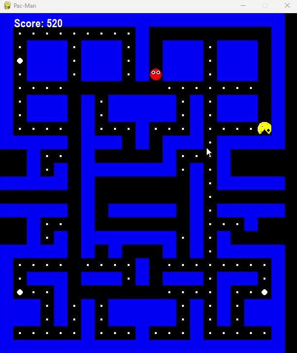

# Py-Pacman 🟡👻

A complete, playable version of the classic arcade game Pac-Man, built from scratch using Python and the Pygame library.

---

## Gameplay Preview



---

## Features

-   **Complete Game Loop:** Includes a start screen, a main game state, and a "Game Over" screen.
-   **Smooth Controls:** Features buffered input for fluid, responsive movement in the maze.
-   **Classic Gameplay Elements:** Collect dots, eat power pellets to make ghosts vulnerable, and chase high scores.
-   **Custom Sprites:** Both Pac-Man and the ghosts are drawn as circular characters with eyes.
-   **Simple AI:** Ghosts move randomly to provide a dynamic challenge.
-   **Restart Functionality:** Easily restart the game by pressing the 'R' key.

---

## Requirements

-   Python 3.x
-   Pygame

---

## How to Play

### Running the Game

1.  **Save the code:** Ensure the game's code is saved in a file named `pacman_game.py`.
2.  **Install Pygame:** If you haven't already, open your terminal and run:
    ```bash
    pip install pygame
    ```
3.  **Run the script:** From the same directory, execute the command:
    ```bash
    python pacman_game.py
    ```

### Controls

-   **Arrow Keys:** Move Pac-Man up, down, left, and right.
-   **'R' Key:** Restart the game from the "Game Over" screen.
